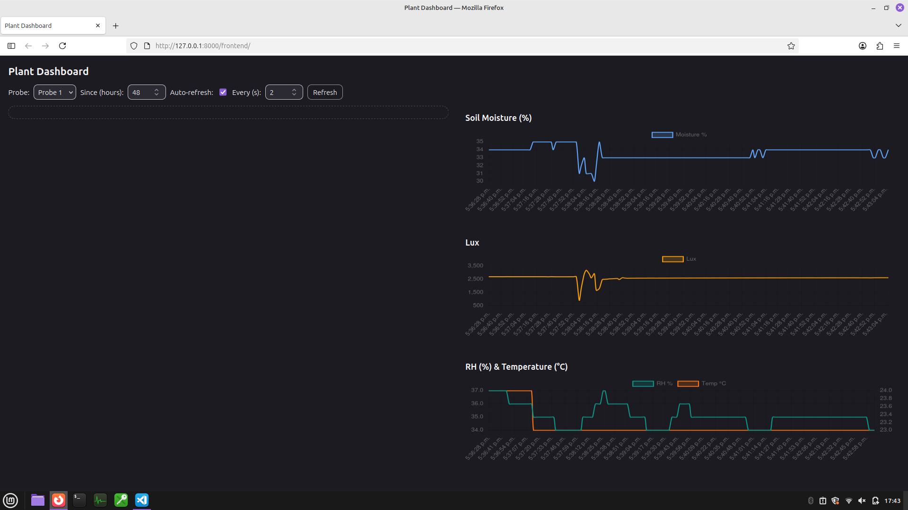

# Plant Pipeline 🌱  


<p align="center">
  
  
</p>


### Executive Pitch  
An end-to-end IoT pipeline that turns plant care from guesswork into data-driven decisions. Built to show how sensor data can flow seamlessly from hardware to database to API to live dashboards—scalable from one houseplant to an agricultural network.  

Plants often fail silently, costing time, money, and yield. Plant Pipeline reframes plant health as a data problem. By tracking soil moisture, light, temperature, and humidity in real time, it provides actionable insights, alerts, and predictive forecasts—like a patient monitor, but for plants.  

> **Origin Story:** My dieffenbachia’s soil would crash from ~40% to 25% moisture unpredictably, leaving me guessing when to water. With this system, I caught the drying pattern early, stopped the yellowing, and now the plant’s producing healthy new leaves.  

### Business Value  
- **For individuals:** anticipate issues, water smarter, and reduce waste.  
- **For organizations:** a reproducible IoT pipeline template that demonstrates how to capture, store, and act on sensor data—transferable to agriculture, industrial IoT, and smart devices.  

### Technical Value  
- End-to-end ownership of a full stack: Arduino → Python ingestion → SQLite → FastAPI → web dashboard.  
- Hardware-optional design via a **probe simulator**, enabling instant demos and rapid prototyping without physical sensors.  
- Extensible roadmap: alerts, machine learning forecasts, wireless deployment, containerization.  

This project demonstrates both **hands-on engineering depth** and the ability to **translate technical work into business outcomes**—bridging the gap between raw data pipelines and real-world value.  

---

## plantpipe  

📌 Current version: [v1](https://github.com/MahonriReynolds/plant-pipeline/releases/tag/v1.0.0)  
(Full development history can be found in the branches, with versions marked by tags on main)  

### Features  
* Reproducible fake probe demo (no hardware needed)  
* Arduino ingestion → SQLite storage → FastAPI API → live dashboard  
* Real-time graphs updating every 2s  
* Clear roadmap: alerts, ML predictions, wireless hardware  

---

## Demo (5-minute Quickstart)  

> No hardware required. This uses an **arduino mimic** that writes oscillating sensor values to a virtual serial port.  

```bash
# 1) Clone
git clone https://github.com/MahonriReynolds/plant-pipeline
cd plant-pipeline

# 2) Python deps (3.10+)
python -m venv .venv
source .venv/bin/activate   # Windows: .venv\Scripts\activate
pip install -U pip
pip install -r requirements.txt

# 3) Create a paired virtual serial port (Linux/macOS)
# This prints two PTY device paths; keep this terminal open.
# Example output shows: PTY is /dev/pts/3 & PTY is /dev/pts/4
socat -d -d pty,raw,echo=0 pty,raw,echo=0

# 4) In a new terminal: start the fake probe, writing to the SECOND device
python arduino_mimic.py --port /dev/pts/4 --interval 2

# 5) In another terminal: start the pipe (src/plantpipe/core/pipe.py), setting PROBE_PORT to the FIRST device:
# DB_PATH = "data/plant.db"
# SCHEMA_PATH = "sql/001_init.sql"

# ** PROBE_PORT = "/dev/pts/3" **

# BAUD = 115200
# API_HOST = "127.0.0.1"
# ...

python pipe.py

# 6) Open the dashboard
http://localhost:8000/frontend
