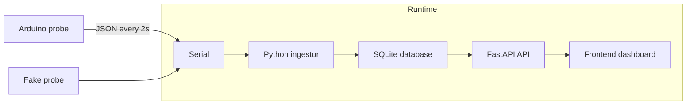

# Plant Pipeline 🌱
End-to-end IoT pipeline that streams plant sensor data (light, humidity, temperature, soil moisture) into a database and visualizes it in real time—**hardware optional** thanks to a probe simulator.

📌 Current version: [v1](https://github.com/MahonriReynolds/plant-pipeline/releases/tag/v1.0.0)  
(Full development history can be found in the branches, with versions marked by tags on main)

## Features
* Reproducible fake probe demo (no hardware needed)
* Arduino ingestion → SQLite storage → FastAPI API → live dashboard
* Real-time graphs updating every 2s
* Clear roadmap: alerts, ML predictions, wireless hardware


---

## Demo (5-minute Quickstart)

> No hardware required. This uses a **fake probe** that writes oscillating sensor values to a virtual serial port.

```bash
# 1) Clone
git clone https://github.com/MahonriReynolds/plant-pipeline
cd plant-pipeline

# 2) Python deps (3.10+)
python -m venv .venv
source .venv/bin/activate   # Windows: .venv\Scripts\activate
pip install -U pip
pip install -r requirements.txt

# 3) Create a paired virtual serial port (Linux/macOS)
# This prints two PTY device paths; keep this terminal open.
# Example output shows: PTY is /dev/pts/3 & PTY is /dev/pts/4
socat -d -d pty,raw,echo=0 pty,raw,echo=0

# 4) In a new terminal: start the fake probe, writing to the SECOND device
python arduino_mimic.py --port /dev/pts/4 --interval 2

# 5) In another terminal: start the pipe (src/plantpipe/core/pipe.py), setting PROBE_PORT to the FIRST device:
# DB_PATH = "data/plant.db"
# SCHEMA_PATH = "sql/001_init.sql"

# ** PROBE_PORT = "/dev/pts/3" **

# BAUD = 115200
# API_HOST = "127.0.0.1"
# ...

python pipe.py

# 6) Open the dashboard
http://localhost:8000/frontend
````

**Expected result:** a live dashboard with soil moisture, lux, RH, and temperature graphs updating \~every 2 seconds.

⚠️ **Windows:** instead of `socat`, use a virtual COM port pair tool (e.g., com0com). Point `arduino_mimic.py` at `COM5` and the ingestor at `COM6`.

---

## What this project does

* **Hardware**: Arduino + sensors: lux, RH/Temp, and capacitive soil moisture, all mounted on a chopstick probe.
* **Ingestion**: Arduino emits a **JSON line every \~2s** over serial. A Python listener ingests readings into **SQLite**.
* **API + UI**: **FastAPI** serves endpoints and a lightweight **HTML/CSS/JS dashboard** at `/frontend` to visualize live data.
* **Dev without hardware**: A **probe simulator** generates oscillating values to a virtual serial port; `socat` pairs it to the ingest process so everything works without physical sensors.

---

## Hardware Setup

Sensors on a chopstick probe connected to an Arduino, streaming JSON over serial.


Hand-drawn wiring diagram:


---

## Architecture (at a glance)



---

## Tech Stack

* **Arduino** (sends JSON readings via USB serial)
* **Python**: ingest script, **FastAPI + Uvicorn** backend
* **SQLite**: local database for simplicity
* **Frontend**: vanilla HTML/CSS/JS served from FastAPI

**Why it’s interesting:** a reproducible **IoT → DB → API → UI** pipeline with a clean hardware-free dev path. The probe simulator makes it demo-able in minutes.

---

## Repo Map

```
.
├── arduino/                 # Arduino sketch for the probe
│   └── plant_probe.ino
├── assets/                  # Screenshots / photos / diagrams
│   ├── v1-dashboard.png
│   ├── plant-with-probe.jpg
│   └── wiring-diagram.jpg
├── docs/
│   └── v1-plan.md
├── frontend/                # Lightweight dashboard
│   ├── index.html
│   ├── app.js
│   └── styles.css
├── scripts/                 # Dev / demo helpers (fake probe, db peek)
│   ├── arduino_mimic.py
│   └── database_peek.py
├── sql/                     # Schema / migrations
│   └── 001_init.sql
├── src/plantpipe/           # Ingest → store → API core
│   ├── api/
│   │   └── api_server.py
│   ├── core/
│   │   ├── logger.py
│   │   └── pipe.py
│   ├── input/
│   │   └── serial_ingestor.py
│   ├── monitoring/
│   │   └── sentinel.py
│   ├── storage/
│   │   └── database.py
│   └── config.py
├── tests/
├── LICENSE
├── pyproject.toml
├── requirements.txt
└── README.md

```

---

## Roadmap

### v2 (branch: `next`)

* Add **“latest status” card** with active/stale marker for quick at-a-glance health.
* Add **threshold-based alerts**:

  * Light too high / average light too low
  * Moisture too low / too high
  * Draft detection via temp/RH swings
* Alerts displayed in the dashboard alongside graphs.

### v3
- Introduce **ML predictions** for soil drying rate:  
  - Train on past moisture + live lux/RH/temp.  
  - Predict “hours until watering needed.”  
  - Adaptive predictions: moving a plant closer to light updates drying rate in real time.

> **Why ML?**  
> While static functions could estimate drying, they can’t capture **implied patterns** across multiple sensors. For example, a temperature spike alone doesn’t instantly dry soil, but a **sustained jump in temp + light + low RH** often signals a steeper drying curve hours later. ML lets the system combine weak signals into a stronger, more adaptive forecast than any single formula.


### v4

* Explore **wireless probe design** (structural hardware changes).
* Multi-probe support (track multiple plants).

---

## License

MIT


